# mcp-tenant-isolation

Static analysis scanner for multi-tenant SaaS and MCP server code. Catches cross-tenant data leakage before it reaches production.

57 deterministic rules covering tenant isolation, database query filters, IDOR, cache key scoping, RLS, schema gaps, and MCP-specific risks (tool visibility, cache prefix, session binding, credential vault). Works with Prisma, Drizzle, raw SQL, Next.js, Express, and Fastify. Includes an MCP server for Claude Desktop and Cursor integration.

[](https://www.npmjs.com/package/mcp-tenant-isolation)
[](https://www.npmjs.com/package/mcp-tenant-isolation)
[](https://github.com/subodhkc/mcp-tenant-isolation/actions/workflows/ci.yml)
[](https://hub.docker.com/r/subodhkc/mcp-tenant-isolation)
[](https://opensource.org/licenses/MIT)

## Who is this for

- **SaaS builders** shipping multi-tenant apps who need to catch cross-tenant data leakage
- **MCP server developers** building tools that handle tenant-scoped data
- **Security teams** who need tenant isolation as part of CI/CD
- **AI agent developers** who want their agents to scan code on demand

## Why

General-purpose security scanners (Snyk, Semgrep, CodeQL) do not understand tenant isolation patterns or MCP server architecture. Cross-tenant data leakage goes undetected. This tool fills that gap with 57 purpose-built deterministic rules.

Every rule is deterministic and reproducible. No machine learning, no false guesses. Each rule checks for specific code patterns, guard presence, and data flow paths. You get the same results every run.

## Install

```bash
npm install -g mcp-tenant-isolation

# or use npx (no install needed)
npx mcp-tenant-isolation scan ./src

# or use Docker (no Node.js needed)
docker run --rm -v $(pwd):/code subodhkc/mcp-tenant-isolation scan /code/src
```

## Quick Start

```bash
mti scan ./src
mti scan ./src --format sarif --output results.sarif
mti scan ./src --format markdown --output TENANT-ISOLATION-REPORT.md
mti scan ./src --format ai --output findings.json
mti scan ./src --severity HIGH
mti init
```

## Demo



## Rules

### 42 General Multi-Tenant Rules

| Prefix | Category | Count | Severity | Description |
|--------|----------|-------|----------|-------------|
| TCM | Tenant Context Management | 6 | Critical | Tenant ID from sessions, not client input. Context propagation across async boundaries. |
| DBQ | Database Query Isolation | 10 | Critical | Every query touching tenant-scoped data must include a tenant filter. |
| IDOR | IDOR Prevention | 5 | Critical | ID-based lookups must verify tenant ownership. |
| CSI | Cache and Session Isolation | 4 | High | Cache keys and session data must be tenant-scoped. |
| API | API Security | 3 | High | Tenant-aware rate limiting and response scoping. |
| FSI | File Storage Isolation | 4 | High | S3, Blob, and filesystem access must be tenant-scoped. |
| LOG | Logging and Audit | 4 | Medium | Audit logs must include tenant context. |
| SCH | Schema and Migration | 6 | High | Prisma models and SQL migrations must include tenant columns. |

### 15 MCP-Specific Rules

| ID | Title | Severity | Description |
|----|-------|----------|-------------|
| MCP-001 | Tool Visibility Scoping | Critical | Tool handler has no tenant-based allow/deny filter. |
| MCP-002 | Cache Key Tenant Prefix | Critical | Tool results cached without tenant prefix. |
| MCP-003 | Session Binding to User+Tenant | Critical | Session ID used as sole authorization. |
| MCP-004 | Token Exchange (RFC 8693) | High | Original token forwarded instead of token exchange. |
| MCP-005 | Per-Tenant Rate Limiting | Medium | No per-tenant rate limiting on tool calls. |
| MCP-006 | Vector Store Tenant Namespace | High | Shared vector store without tenant namespaces. |
| MCP-007 | Tool Description Injection | Medium | Tool description could bypass isolation. |
| MCP-008 | Credential Vault Tenant Scoping | Critical | Credential vault stores tokens without tenant scoping. |
| MCP-009 | Shared Service Account | High | Single shared API key for all tenant API calls. |
| MCP-010 | Session Cleanup on Disconnect | Medium | No deterministic session cleanup. |
| MCP-011 | Telemetry Tenant Identifier | Low | Telemetry strips tenant identifier. |
| MCP-012 | Local Bind (127.0.0.1) | High | MCP server binds to 0.0.0.0 instead of 127.0.0.1. |
| MCP-013 | Filesystem Tenant Root | High | Tool handler accesses filesystem without tenant root. |
| MCP-014 | Cross-Tenant Artifact Leakage | High | Artifact storage without tenant prefix. |
| MCP-015 | Dynamic Tool Namespace | Medium | Tools registered without tenant namespace. |

## Architecture

The scanner pipeline works in six stages:

1. **Parsers** - Babel AST for TS/JS, Prisma schema parser, SQL migration parser, MCP SDK import detection
2. **IR and Flow Graph** - Intermediate representation capturing sources, sinks, guards, routes, MCP tool definitions
3. **Rule Engine** - 57 deterministic rules evaluated against the IR. Each rule defines sources, sinks, required guards
4. **False Positive Filter** - Test file detection, confidence scoring, pattern refinement
5. **Reporters** - Terminal (with verdict), JSON, SARIF 2.1.0, AI-friendly JSON (with remediation hints), Markdown (shareable report)
6. **CLI and MCP Server** - `mti` CLI with scan/init/rules/suppress/baseline/mcp commands. MCP server exposes 4 tools

## MCP Server

The package includes an MCP server for AI agent integration. It runs locally via stdio transport (no hosting required):

```json
{
  "mcpServers": {
    "tenant-isolation": {
      "command": "npx",
      "args": ["-y", "mcp-tenant-isolation", "mcp"]
    }
  }
}
```

Add this to your Claude Desktop, Cursor, or other MCP client config to let your AI agent scan code for tenant isolation issues on demand.

### MCP Tools

| Tool | Description |
|------|-------------|
| `scan_tenant_isolation` | Scan a file path or inline code. Returns structured findings. |
| `list_tenant_isolation_rules` | Returns all 57 rules with metadata. Filterable by category. |
| `explain_tenant_isolation_rule` | Returns rule details, OWASP mapping, CWE IDs, fix suggestions. |
| `suppress_tenant_isolation_finding` | Add a suppression with reason and expiration. |

## CI/CD Integration

### Option 1: Pre-built GitHub Action (easiest)

Add this to `.github/workflows/tenant-isolation.yml`:

```yaml
name: Tenant Isolation Scan
on: [push, pull_request]
jobs:
  scan:
    runs-on: ubuntu-latest
    permissions:
      contents: read
      security-events: write
    steps:
      - uses: actions/checkout@v4
      - uses: subodhkc/mcp-tenant-isolation@v1
        with:
          path: ./src
          severity: HIGH
          fail-on: HIGH
```

Runs the scan, uploads SARIF to GitHub Code Scanning, generates a Markdown report artifact, and fails the workflow if HIGH or CRITICAL findings are detected.

### Option 2: Manual npx

```yaml
# .github/workflows/tenant-isolation.yml
name: Tenant Isolation Scan
on: [push, pull_request]
jobs:
  scan:
    runs-on: ubuntu-latest
    permissions:
      contents: read
      security-events: write
    steps:
      - uses: actions/checkout@v4
      - uses: actions/setup-node@v4
        with:
          node-version: 20
      - run: npx mcp-tenant-isolation scan ./src --format sarif --output results.sarif
      - uses: github/codeql-action/upload-sarif@v3
        with:
          sarif_file: results.sarif
```

### Exit Codes

| Code | Meaning |
|------|---------|
| 0 | No findings |
| 1 | Findings found |
| 2 | Error (config invalid, parse failure, etc.) |

### GitHub Code Scanning Integration

When you upload SARIF output using `github/codeql-action/upload-sarif@v3`, findings appear in your repository's **Security > Code scanning alerts** tab. This works with both free and Advanced Security-enabled repos.

What happens:
1. `mti scan --format sarif --output results.sarif` generates a SARIF 2.1.0 file
2. `upload-sarif` action sends it to GitHub's code scanning API
3. Each finding becomes a code scanning alert with file, line, severity, and remediation hint
4. Alerts can be dismissed, fixed, or tracked directly in the GitHub UI
5. Pull request annotations appear automatically on changed files

Requirements:
- `permissions: security-events: write` in your workflow
- The SARIF file must be generated before the upload step

## Configuration

Create `.mtirc.json` in your project root:

```json
{
  "rules": {
    "severity": {
      "DBQ-001": "HIGH",
      "MCP-001": "CRITICAL"
    },
    "exclude": ["DBQ-010"]
  },
  "paths": {
    "include": ["src/**/*"],
    "exclude": ["**/*.test.ts", "**/*.spec.ts"]
  },
  "suppressions": ".mti-suppressions.json",
  "baseline": ".mti-baseline.json"
}
```

### Advanced Configuration

```json
{
  "rules": {
    "severity": { "DBQ-001": "HIGH" },
    "exclude": ["DBQ-010"]
  },
  "paths": {
    "include": ["src/**/*"],
    "exclude": ["**/*.test.ts"]
  },
  "output": "terminal",
  "framework": "nextjs-app-router",
  "authHelpers": ["requireAuth", "getServerSession", "withAuth"],
  "tenantGuards": ["organizationId", "tenantId", "workspaceId"],
  "modelScopes": {
    "userScoped": ["User", "UserSession"],
    "global": ["Tenant", "AuditLog"]
  },
  "rulePacks": ["./custom-rules.json"],
  "suppressions": ".mti-suppressions.json",
  "baseline": ".mti-baseline.json"
}
```

| Field | Description |
|-------|-------------|
| `output` | Default output format: `terminal`, `json`, `sarif`, `ai`, `markdown` |
| `framework` | Framework hint: `nextjs-app-router`, `nextjs-pages`, `express`, `fastify`, `auto` |
| `authHelpers` | Custom auth function names to detect (reduces false positives) |
| `tenantGuards` | Custom tenant guard variable names beyond the defaults |
| `modelScopes` | Override model scope classification (userScoped, global, tenantScoped) |
| `rulePacks` | Paths to custom rule pack JSON files |

## Report Formats

| Format | Flag | Use Case |
|--------|------|----------|
| Terminal | `--format terminal` (default) | Developer console with pass/fail verdict |
| JSON | `--format json` | Programmatic consumption, piping to other tools |
| SARIF | `--format sarif` | GitHub Code Scanning, Azure DevOps |
| AI JSON | `--format ai` | AI agent consumption with remediation hints and context |
| Markdown | `--format markdown` | Shareable report for PRs, team review, documentation |

```bash
# Generate a Markdown report for a PR
mti scan ./src --format markdown --output TENANT-ISOLATION-REPORT.md

# Upload SARIF to GitHub Code Scanning
mti scan ./src --format sarif --output results.sarif
```

## Tech Stack

- AST Parsing: @babel/parser (TypeScript, JSX), Prisma schema parser, SQL migration parser
- Rule Engine: RuleSpec declarative pattern with guard detection and evidence building
- CLI: Commander
- MCP: @modelcontextprotocol/sdk (stdio transport)
- Output: Terminal (with verdict), JSON, SARIF 2.1.0, AI JSON (with remediation), Markdown
- Testing: Vitest

## Roadmap

### v1.6.2 (Current)
- 57 rules (42 general + 15 MCP-specific)
- TypeScript and JavaScript support
- Prisma schema analysis
- SQL migration analysis (RLS, tenant columns, indexes)
- CLI (mti) with terminal, JSON, SARIF, AI JSON, Markdown output
- Pass/fail verdict in terminal and Markdown reports
- Remediation hints for all 57 rules
- MCP server for AI agent integration
- Suppression policy with expiration
- Baseline tracking with diff
- Severity override in .mtirc.json
- Custom rule packs (JSON)
- Configurable auth helpers and tenant guards
- Model scope classification with config overrides
- Framework detection (Next.js, Express, Fastify)
- Non-production path filtering

### v1.1.0 (Planned)
- Python support (FastAPI, Django, Flask)
- SQLAlchemy ORM analysis
- Watch mode (mti scan --watch)
- VS Code extension

### v2.0.0 (Future)
- Runtime two-tenant adversarial test harness
- Go and Ruby language support
- Incremental scanning with AST cache

## Links

- [Landing Page](https://www.haiec.com/mcp-tenant-isolation)
- [GitHub](https://github.com/subodhkc/mcp-tenant-isolation)
- [npm](https://www.npmjs.com/package/mcp-tenant-isolation)
- [HAIEC](https://www.haiec.com)
- [Built by Subodh Kc](https://subodhkc.com)

## License

MIT. Free and open source.
